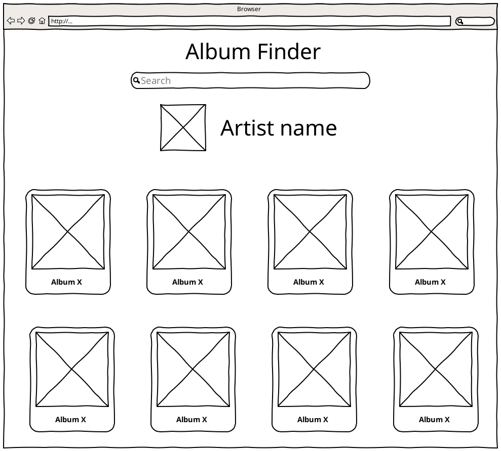
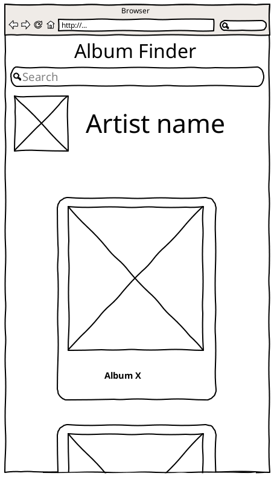

# Critical Mass PWA Test

## Objetivo

Desenvolver uma aplicação para consultar álbuns de um determinado artista

## Stack

- React
- styled-components
  - CSS Grid
- React Hooks _ou_ MobX
- [API GraphQL Spotify](<https://spotify-graphql-server.herokuapp.com/graphql?query=%7B%0A%20%20queryArtists(byName%3A%20%22Metallica%22)%20%7B%0A%20%20%20%20name%0A%20%20%20%20id%0A%20%20%20%20image%0A%20%20%20%20albums%20%7B%0A%20%20%20%20%20%20name%0A%20%20%20%20%20%20id%0A%20%20%20%20%20%20image%20%0A%20%20%20%20%7D%0A%20%20%7D%0A%7D%0A>)
  - Para simplificar o App, considere o primeiro item do array de `queryArtists`
- Service Worker
  - App deve funcionar off-line (manter buscas no cache)

## Wireframes

### Desktop Browser

### Mobile Browser

## Pull Request

Submeter uma PR [para esse repositório](https://github.com/criticalmassbr/cm-pwa-test) com o README atualizado sobre como executar o projeto.

### Instruções para executar o projeto aqui:

This project was bootstrapped with [Create React App](https://github.com/facebook/create-react-app).

## Available Scripts

In the project directory, you can run:

### `yarn start`

Runs the app in the development mode. 
Open [http://localhost:3000](http://localhost:3000) to view it in the browser.

The page will reload if you make edits. 
You will also see any lint errors in the console.

### `yarn test`

Launches the test runner in the interactive watch mode. 
See the section about [running tests](https://facebook.github.io/create-react-app/docs/running-tests) for more information.

### `yarn build`

Builds the app for production to the `build` folder. 
It correctly bundles React in production mode and optimizes the build for the best performance.

The build is minified and the filenames include the hashes. 
Your app is ready to be deployed!

See the section about [deployment](https://facebook.github.io/create-react-app/docs/deployment) for more information.
